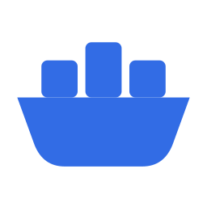

# ferry

Kubernetes on a Mac where **the pod is the virtual machine** and there is no
Linux host anywhere in the system.

The control plane runs as native Mach-O processes on macOS. Each pod is a
lightweight VM on `Virtualization.framework` with its own kernel. There is no
node VM to size, nothing nested, and no shared kernel between pods.

|  | isolation | overhead |
|---|---|---|
| Docker Desktop / colima / kind | one Linux VM, pods share a kernel | a VM you size up front |
| kiac / Orchard | VM per **node**, pods share the node's kernel | 2–4 GB per node, idle or not |
| **ferry** | VM per **pod** — every pod its own kernel | pods only |

Pod semantics fall out of the VM boundary: one VM is one network stack, so
containers in a pod share localhost and IPC by construction. No pause
container, no network namespace plumbing.

## Status

Early, but the load-bearing questions are answered. **[docs/HANDOFF.md](docs/HANDOFF.md)
is the full picture** — architecture, findings, next steps, and the gotchas that
cost time.

- ✅ **Control plane runs natively on macOS.** etcd + kube-apiserver +
  kube-controller-manager + kube-scheduler as darwin/arm64 processes. Serves
  `/version` as `platform: darwin/arm64`, reconciles Deployment → ReplicaSet →
  Pods, issues ServiceAccount tokens.
- ✅ **The kubelet works on macOS** with ~450 lines of platform glue. Drives a
  full pod lifecycle over CRI. See
  [experiments/01-kubelet-cri-surface](experiments/01-kubelet-cri-surface/FINDINGS.md).
- ✅ **The Mac registers as a real Kubernetes node** and runs scheduled
  workloads. `kubectl get nodes` reports `OS-IMAGE: macOS 26.6.2`; a 10-replica
  Deployment reaches 10/10. See
  [experiments/02-node-registration](experiments/02-node-registration/FINDINGS.md).
- ✅ **The VM ceiling is 128, and Kubernetes' default is 110.** One VM per pod
  fits, with 18 to spare. Guests boot to userspace in ~0.12s and VM memory is
  lazily backed — 64 GiB configured cost 1.6 GiB resident. See
  [experiments/03-vm-ceiling](experiments/03-vm-ceiling/FINDINGS.md).
  The ceiling is invariant to devices: 128 bare, 128 with a NIC each, 128 with
  a NIC and a rootfs block device each.
- ✅ **Routable per-pod networking works.** A `VmnetNetwork` allocates an address
  per pod with the Mac as gateway; a real Alpine pod boots in **0.33s**, answers
  ping from the host in **0.34ms**, and reaches another pod directly. No root
  required. See [experiments/04-pod-networking](experiments/04-pod-networking/FINDINGS.md).
- ✅ **`ferry-cri` runs real pods.** A CRI implementation in Swift on Apple's
  Containerization framework. `kubectl` schedules pods; each becomes its own VM
  with its own routable IP, reachable from the Mac at ~0.4ms. The API server
  advertises the pod gateway, so it is reachable from inside a pod. See
  [experiments/05-real-pods](experiments/05-real-pods/FINDINGS.md).
- ✅ **Volumes work.** Mounts become virtiofs shares into the pod VM. Projected
  ServiceAccount tokens, ConfigMaps and emptyDir all verified — including a pod
  that authenticates to the API server with its own token.
- ✅ **Resource limits and securityContext work.** The kubelet does not send
  `ContainerConfig.Linux` on darwin, so every pod silently ran unbounded with
  default capabilities; ferry's kubelet derives that code path for darwin.
  A pod with `limits.memory: 300Mi` now gets `memory.max=314572800` in its
  guest cgroup, and `NET_ADMIN` reaches the container.
- ✅ **`kubectl attach` works.** The framework cannot re-open a running
  process's stdio — but ferry owns that stdio, so attach subscribes to the
  writer the container's output already flows through.
- ✅ **`kubectl port-forward` works.** Unusually simple here: pod IPs are
  routable from the Mac, so there is no namespace to enter — the streamer dials
  the pod directly.
- ✅ **Sidecars work.** Containers in a pod share one VM, and therefore one
  network stack: a process in one reaches a listener in another over
  `127.0.0.1`. The hypervisor cannot add a container to a running VM, so the
  boot waits until the kubelet has created them all.
- ✅ **`kubectl exec` works** — stdin, stderr and exit codes included. CRI
  carries exec over SPDY rather than gRPC, so `ferry-streamer` terminates that
  using Kubernetes' own streaming server and hands the request to `ferry-cri`.
- ✅ **Services route inside the pods, with kube-proxy's own rules.**
  `ferry-proxyd` runs kube-proxy's rule generation natively on macOS and renders
  the ruleset; each pod applies it to its own kernel. Traffic goes pod to pod
  and nothing needs root. See [docs/SERVICES.md](docs/SERVICES.md).
- ✅ **Pods can use the Mac's GPU.** Not pass-through -- there is none on Apple
  silicon, and Metal is reachable only from a macOS process. `ferry-gpud` holds
  the GPU and a pod that requests `ferry.dev/gpu` is handed a unix socket to it,
  relayed into its VM over vsock. A scheduled pod reached 9.4 TFLOP/s of Metal
  matmul and ran the on-device model; a second pod requesting it waits on the
  scheduler, with no device plugin anywhere. Pods share the device by preemption
  -- a pod wanting a fraction of a second waits 0.6s while another holds 35
  seconds of work, or 0.1s if its PriorityClass outranks the pod holding the
  device -- and `kubectl` shows what each pod has used. See
  [docs/GPU.md](docs/GPU.md) and
  [experiments/08-vsock-socket-relay](experiments/08-vsock-socket-relay/FINDINGS.md).
- ✅ **Cluster DNS works.** CoreDNS runs as a pod on an address reserved before
  any pod can take it, so the kubelet can be told where DNS lives before DNS
  exists. Pods resolve external names and cluster names.
- ✅ **Cluster upgrades work.** `ferry upgrade plan|apply|nodes|rollback` moves
  the control plane in place against the same etcd, then drains and replaces
  each kubelet while the runtime keeps holding the pod VMs. A cluster went
  v1.34.0 → v1.34.11, back, and forward again: the workload kept the same pods,
  the same IPs and zero restarts across the control plane switch, and rollback
  lost nothing because the etcd minor did not change. One version now drives the
  kubelet, the control plane and etcd together, which it did not before — asking
  for a newer one used to produce a kubelet newer than the API server, silently.
  See [docs/UPGRADES.md](docs/UPGRADES.md).

## Why this can work

Nothing in the control plane touches the kernel — it is a database and three
programs that watch it. Only the kubelet, kube-proxy, and the workloads need
Linux, and Apple's Containerization framework supplies Linux.

Its `SandboxContext` gRPC API already models what a pod needs: multiple
containers per VM (`CreateProcessRequest.containerID`,
`ContainerStatisticsRequest.container_ids` — *"Empty = all containers"*),
arbitrary mounts, in-guest network configuration, and cgroups v2 via `vminitd`.
One-container-per-VM is the `container` CLI's policy, not a framework limit.

## Layout

```
install.sh                           what get.ferry.kurpuis.com serves: curl | sh
CNAME                                the domain, copied into the published site
.github/workflows/pages.yml          publishes install.sh to that domain from main
release/build.sh                     package a built checkout into a release tarball
release/publish.sh                   put one on GitHub Releases
ferry                                the CLI: doctor, build, up, down, status, logs, upgrade
lib/versions.sh                      the version store, and what may follow what
build-kubelet.sh                     build darwin kubelet from upstream + overlay
patches/kubelet/                     platform implementations, mirroring upstream paths
control-plane/                       PKI + up/down for the native control plane
manifests/                           CoreDNS, rendered at 'ferry up'
tests/                               what can be checked without a cluster
docs/                                HANDOFF.md (the full picture), INSTALL.md, SERVICES.md
experiments/01-kubelet-cri-surface/  fake CRI runtime + harness
experiments/02-node-registration/    the Mac as a node, against the real API
experiments/03-vm-ceiling/           how many VMs macOS runs, and how fast
experiments/04-pod-networking/       routable per-pod addressing, host and pod to pod
experiments/05-real-pods/            the whole stack, with real VMs per pod
experiments/06-kube-proxy-on-macos/  kube-proxy's rule generation, rendered on darwin
experiments/07-vmnet-leak/           what a refused vmnet subnet actually means
experiments/08-vsock-socket-relay/   a host socket, inside a pod, over vsock
experiments/12-gpu-contention/       what shares this Mac's silicon and what does not
ferry-cri/                           the CRI runtime: one VM per pod
ferry-streamer/                      SPDY streaming for exec, attach and port-forward
ferry-proxyd/ (in patches/)          kube-proxy's rule generation, built for darwin
guest/                               nft, bundled with its loader for pods
ferry-proxy/                         host-side ClusterIP routing (fallback)
ferry-gpud/                          the Mac's GPU, offered to pods over a socket
kernel/                              guest kernel with NAT support
assets/                              the logo
bin/versions/<vX.Y.Z>/               kubelet, control plane and etcd per version
bin/                                 build output, symlinked to a version (gitignored)
```

## Install

```sh
curl -sfL https://get.ferry.kurpuis.com | sh -
```

That downloads a release, puts `ferry` and a matching `kubectl` on your PATH,
registers a login agent so the cluster comes back after a reboot, and starts it.
No Swift, no Go, no Kubernetes source tree, and no `sudo` — the release carries
the kubelet, the control plane, etcd, the runtime and the guest kernel already
built.

Adding a second Mac is one line from the first Mac's `ferry token create`:

```sh
curl -sfL https://get.ferry.kurpuis.com | FERRY_URL=mac1.local:6443 FERRY_TOKEN=F10… sh -
```

A release also carries **mode 2** — the node as the VM, pods sharing its kernel
([docs/MACHINES.md](docs/MACHINES.md)) — off until `ferry machines enable`.

Details, the environment variables, and how to uninstall are in
[docs/INSTALL.md](docs/INSTALL.md). To build ferry instead of installing it, see
[Building from source](#building-from-source).

## Try it

```sh
export KUBECONFIG=~/.ferry/admin.conf     # or: ferry kubeconfig --merge
kubectl run demo --image=ghcr.io/linuxcontainers/alpine:3.20 --restart=Never \
  --command -- /bin/sh -c "echo hello from a VM; sleep 3600"

kubectl get pods -o wide          # each pod has its own routable address
kubectl logs demo
ping "$(kubectl get pod demo -o jsonpath='{.status.podIP}')"

# Services route inside the pods, using kube-proxy's own rules
kubectl run web --image=busybox --restart=Never \
  --command -- sh -c "echo hi from a Service > /tmp/index.html; httpd -f -p 8080 -h /tmp"
kubectl expose pod web --port 80 --target-port 8080
kubectl run probe --image=busybox --restart=Never --command -- sleep 3600
kubectl exec probe -- wget -qO- http://web

ferry status
ferry down
```

`ferry doctor` explains what is missing if the machine is not ready.

### Limits worth knowing

- **A pod's containers are fixed at boot.** `Virtualization.framework` cannot
  hotplug, so the VM does not start until the kubelet has created every container
  in the pod. Sidecars work and share `127.0.0.1`; init containers work, each
  exiting before the next is created, with shared volumes carrying state across.
  What cannot happen is a container joining a pod whose VM is already running.
- **The cluster starts at login, not at boot.** `Virtualization.framework` will
  not make a VM from a process outside a user session, so the login agent is a
  LaunchAgent rather than a LaunchDaemon. A Mac that reboots to the login window
  holds the cluster there until somebody logs in — and a Mac that *joined*
  another cluster does not come back at all, because a worker's credentials live
  under `/tmp`. Rejoin it with a fresh token.
- **Services** route inside each pod using kube-proxy's own rules and need no
  privilege on the Mac — the release ships the guest kernel that makes this
  work; a checkout has to `ferry kernel` first, or ferry falls back to a host
  proxy that does need root. Conntrack is not reconciled, and only TCP has been
  verified.
- `logs`, `exec`, `port-forward` and `attach` all work. Attach needs the pod to
  set `stdin: true` to accept input, since the stream has to be wired in when
  the container is created.
- **Memory decides how many pods fit, not the 128-VM ceiling.** An idle pod VM
  costs **226 MiB** of host memory before its workload does anything — flat at
  8, 20, 24 and 40 pods, and unmoved by `--pod-memory-mib`, so it is the price
  of a kernel rather than a pod using its allowance. 110 of those is 24 GiB.
  ferry therefore sets `maxPods` from the machine's memory, budgeting half of it
  for that overhead: 72 on a 32 GiB Mac, 110 on a 64 GiB one, overridable with
  `FERRY_MAX_PODS`. The hypervisor's 128-VM ceiling is still shared — every
  other VM, Docker Desktop included, takes one of ferry's slots — but on most
  Macs memory runs out first. See
  [experiments/13-shared-kernel-cost](experiments/13-shared-kernel-cost/FINDINGS.md).
- **Restarting in quick succession moves the pod network.** A vmnet subnet stays
  reserved for about a minute after the run using it stops, and there are 32
  networks across the whole Mac, so a restart takes the next free subnet. Pods
  and Services are unaffected; CoreDNS rolls out again because the gateway is
  part of its config. See
  [experiments/07-vmnet-leak](experiments/07-vmnet-leak/FINDINGS.md).
- **`ferry down` leaves the cluster's objects in etcd.** It stops processes; it
  does not delete anything. Pods come back on the next `ferry up`.

## Requirements

To **run** ferry, which is what `curl -sfL https://get.ferry.kurpuis.com | sh -` does:

- Apple silicon, macOS 26 (Tahoe)

That is the whole list. The release is built binaries, ad-hoc signed — including
the `com.apple.security.virtualization` entitlement `ferry-cri` needs, which is a
hash of the binary itself and so survives the trip to another Mac.

## Building from source

Only needed to change ferry. Everything below is a *build* dependency; a Mac
running a cluster needs none of it.

```sh
git clone https://github.com/imaustink/ferry && cd ferry
./ferry doctor    # check this machine can build ferry
./ferry build     # kubelet, runtime, guest kernel
./ferry up
```

- Go 1.24+
- Docker, for `ferry kernel` — the guest kernel is the one slow build, and the
  only reason a release is packaged on a Mac rather than in CI.
- **Swift 6.2+, and 6.4 is what ferry is built with.** Use the same toolchain on
  every Mac in a cluster: binaries are copied between machines, and two
  toolchains produce two builds that are only probably the same. A release
  sidesteps this — every Mac installing it gets the same binaries, and the
  toolchain that made them is recorded in its `VERSION`.

  The OS upgrade does not bring the toolchain with it, and the version Apple
  offers moves, so ask before installing:
  ```sh
  softwareupdate --list | grep "Command Line Tools"
  sudo rm -rf /Library/Developer/CommandLineTools          # see below
  sudo softwareupdate --install "Command Line Tools for Xcode <version>"
  ```

  **Remove the old one first.** Both `softwareupdate --install` and
  `xcode-select --install` lay a version down beside whatever is already there,
  and the result reports a healthy version number while being unable to build
  anything — a 6.3 driver reading 6.4 module interfaces, or a `swift-package`
  that dies in dyld before it reads a manifest. `ferry doctor` checks for this
  by running SwiftPM rather than by asking it its version.

Most of this was developed on macOS 15. What actually needs 26 is routable
per-pod addressing (`VZVmnetNetworkDeviceAttachment`) and the toolchain Apple's
Containerization framework requires to build.

### Cutting a release

```sh
./ferry build && ./ferry kernel && ./ferry node-image   # everything the tarball carries
git tag -a v0.1.0 -m "..." && git push origin v0.1.0
./release/build.sh --version v0.1.0
./release/publish.sh --version v0.1.0      # a draft; --publish to go live
```

`release/build.sh` packages the runtime subset of the checkout and refuses to
ship one that is missing a piece — including mode 2's node image, unless told
`--without-node-image`, which the release then records. `release/publish.sh`
refuses a dirty tree, or a tarball built from a commit other than the tag's.

`install.sh` itself is served from GitHub Pages, republished from `main`
whenever it changes, so the installer people run is the one in this repository.
The one-time DNS and Pages setup is in [docs/INSTALL.md](docs/INSTALL.md).
